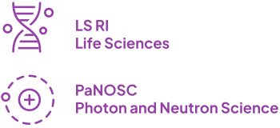
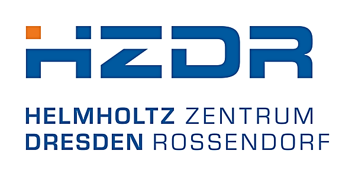
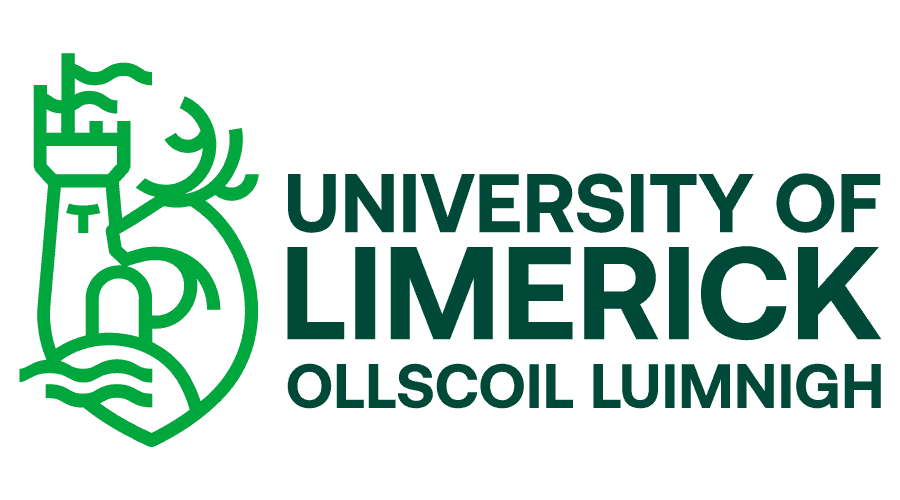

  

    To overcome fragmentation of training resources across Research Infrastructures (RIs)
    and the Science Clusters, the mTeSS-X project aims to enhance the existing 
    <a href="https://tess.elixir-europe.org/about"> ELIXIR TeSS platform</a> &mdash; 
to build an aggregator for training portals like ELIXIR TeSS and 
    <a href="https://www.panosc.eu/training-catalogue/">PaNOSC training portals</a>
    &mdash; to natively support federation. 
    
    Such a fully-featured open-source multi-tenanted training platform is expected to be an 
    innovation for building a federation of portals to:

    <ul>
      <li> help break down barriers between thematic communities,</li>
      <li> promote a more cohesive European research community, </li>
      <li> and promote FAIR and open training.</li>
     </ul>
  

  
  

The project strives to support the federation of training catalogues using a multi-tenancy approach, and enabling cross-instance content exchange. 
This will allow RIs and their communities to maintain tailored catalogues with distinct identities, while simultaneously benefiting from a shared global pool of resources.

* [View the project page on the OSCARS website](https://www.oscars-project.eu/projects/mtess-x-scaling-training-portal-federation-ris-through-multi-tenanting-and-exchange)

  

    <h3>Challenge</h3>
    
Fragmentation of resources hampers the reuse of valuable training materials
      and limits the dissemination of events and learning pathways.  
      The main challenges of the project are i) to enable the federation of catalogues,
      ii) support cross-discipline training resource exchange, and iii) celebrate and maintain
      catalogue unique identity. 

  

  

    <h3>Solution</h3>
    
mTeSS-X will extend the TeSS platform by introducing multi-tenancy, allowing
     multiple communities to maintain distinct training catalogues within a shared
     instance, while preserving their individual identities.  
     It will also implement TeSS-X plugins to facilitate seamless content exchange between
     catalogues implemented as separate instances. 

  

  

    <h3>Scientific Impact</h3>
    
By fostering the federation of interoperable training catalogues, mTeSS-X will
      significantly enhance the findability, accessibility, and reuse of high-quality training
      resources (<a href="https://www.go-fair.org/fair-principles/">FAIR principles</a>). 

  

### Research domains
Life sciences, Photon/neutron sources-based experimental research

### Partners

  

    
  

  

    
  

  

    
  

  

    
  

<!--
[The University of Manchester](https://www.manchester.ac.uk/), [Helmholtz-Zentrum Dresden-Rossendorf](https://www.hzdr.de/db/Cms?pOid=44909&pNid=0&pLang=en), [University of Limerick](https://www.ul.ie/), [University of Tartu](https://ut.ee/en)
-->

### Supporters

[ALBA Synchrotron](https://www.cells.es/en), [Bioconductor](https://bioconductor.org/), [BioFAIR](https://biofair.uk/), [ELIXIR Belgium](https://www.elixir-belgium.org/), [ELIXIR Europe](https://elixir-europe.org/), [Ersilia](https://www.ersilia.io/), [European Synchrotron Radiation Facility (ESRF)](https://esrf.fr/), [Helmholtz Metadata Collaboration (HMC) Hub Matter](https://helmholtz-metadaten.de/en), [OLS](https://we-are-ols.org/)

### Project team members
Carole Goble (Principle Investigator, The University of Manchester), Oliver Knodel (Helmholtz-Zentrum Dresden-Rossendorf), Finn Bacall (The University of Manchester), Phil Reed (The University of Manchester), Munazah Andrabi (The University of Manchester), Maria Doyle (University of Limerick), Hedi Peterson (TARTU ULIKOOL)
